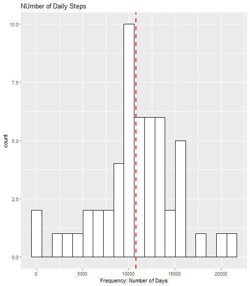
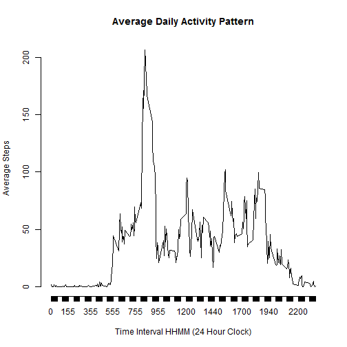
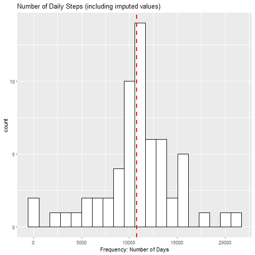
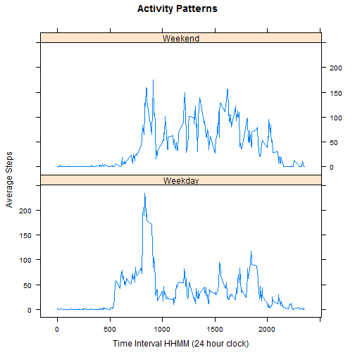

## R Markdown

---
title: "Reproducible Research: Peer Assessment 1"
output: 
  html_document:
    keep_md: true
---


## Loading and preprocessing the data

```r
library(ggplot2)
activity<-read.csv("activity.csv", sep = ",", header=TRUE)
```

## Histogram of the total number of steps taken each day

```r
dailysteps<-aggregate(steps ~ date, activity, sum)
head(dailysteps)
```

```
##         date steps
## 1 2012-10-02   126
## 2 2012-10-03 11352
## 3 2012-10-04 12116
## 4 2012-10-05 13294
## 5 2012-10-06 15420
## 6 2012-10-07 11015
```

```r
ggplot  (data=dailysteps, aes(x=steps)) +
         geom_histogram(bins=20, color="black", fill = "white") +
         ggtitle("NUmber of Daily Steps") +
         xlab("Frequency: Number of Days") +
        geom_vline(aes(xintercept=mean(steps, na.rm=T)), 
               color="red", linetype="dashed", size=1)
```




## Mean and Median number of steps taken per day
Mean total number of steps:

```r
mean(dailysteps$steps)
```

```
## [1] 10766.19
```

Median total number of steps:

```r
median(dailysteps$steps)
```

```
## [1] 10765
```


## What is the average daily activity pattern?
Time Series

```r
AvgIntervalSteps<-aggregate(steps~interval, data=activity, FUN=mean, na..action=na.omit)
plot(AvgIntervalSteps$interval, AvgIntervalSteps$steps, type="l", axes=F, xlab="", ylab="")
  axis(2)
  axis(1, at=AvgIntervalSteps$interval)
  title(xlab="Time Interval HHMM (24 Hour Clock)" )
  title(ylab="Average Steps")
  title(main="Average Daily Activity Pattern")
```



On an average, maximum activity is at 

```r
which.max(AvgIntervalSteps[,2])
```

```
## [1] 104
```

```r
AvgIntervalSteps[which.max(AvgIntervalSteps[,2]),]
```

```
##     interval    steps
## 104      835 206.1698
```
##Activity starts around 5:00 am and spikes at 8:35 and slows down after 6:30

## Imputing missing values


```r
missing<-sum(is.na(activity$steps))
```
Number of missing values:

```r
missing
```

```
## [1] 2304
```

## Strategy for imputing values - use average number of steps for given interval and fill in missing values

```r
Actwithavg<-merge(x=activity, y=AvgIntervalSteps, by="interval", all.x=TRUE)
names(Actwithavg)[2]<-"steps"
names(Actwithavg)[4]<-"AvgIntSteps"
Actwithavg$imputedsteps<-
      ifelse(is.na(Actwithavg$steps), Actwithavg$AvgIntSteps, Actwithavg$steps)
```

Check number of missing values after imputing:

```r
missing<-sum(is.na(Actwithavg$imputedsteps))
missing
```

```
## [1] 0
```
## Create new histogram with no missing values

```r
NewActivity<-aggregate(imputedsteps ~ date, Actwithavg, sum)
ggplot  (data=NewActivity, aes(x=imputedsteps)) +
    geom_histogram(bins=20, color="black", fill = "white") +
    ggtitle("Number of Daily Steps (including imputed values)") +
    xlab("Frequency: Number of Days") +
    geom_vline(aes(xintercept=mean(imputedsteps, na.rm=T)), 
               color="red", linetype="dashed", size=1)
```



## Are there differences in activity patterns between weekdays and weekends?
## Infer whether date in data is a weekday or weekend

```r
library(lattice)
activity$days<-weekdays(as.Date(activity$date))
activity$weeklabel<-
      ifelse(activity$day == "Saturday" | activity$day == "Sunday", "Weekend", "Weekday")

ActAvgInterval<-aggregate(steps~interval*weeklabel, data=activity, FUN=mean, na..action=na.omit)
xyplot(steps~interval|weeklabel, 
        data=ActAvgInterval, 
        type="l", layout=c(1,2), 
        xlab="Time Interval HHMM (24 hour clock)", 
        ylab="Average Steps", 
        main="Activity Patterns")
```




## There is a marked difference in activity patterns between Weekdays and Weekends. Activity starts earlier on weekdays, but tapers off around 8:00 am with a small burst in the evening; on weekends, activity starts later, but there are periods of activity for most of the day, tapering off in the evening.

